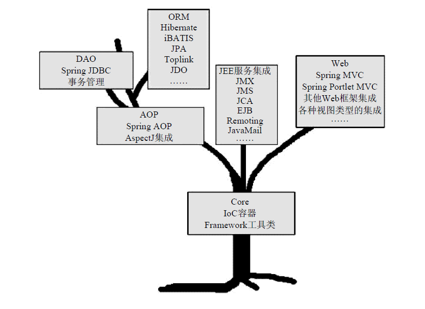
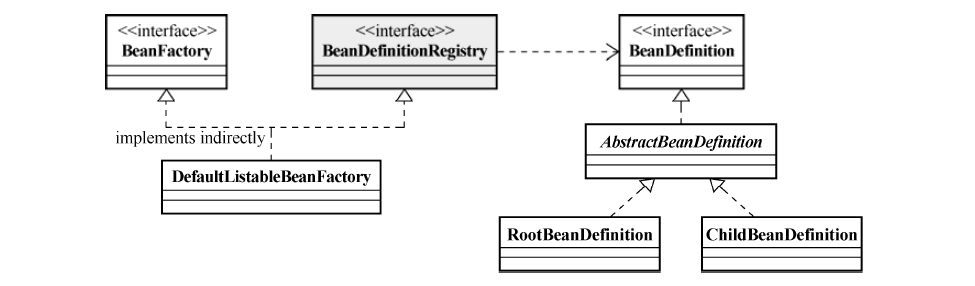
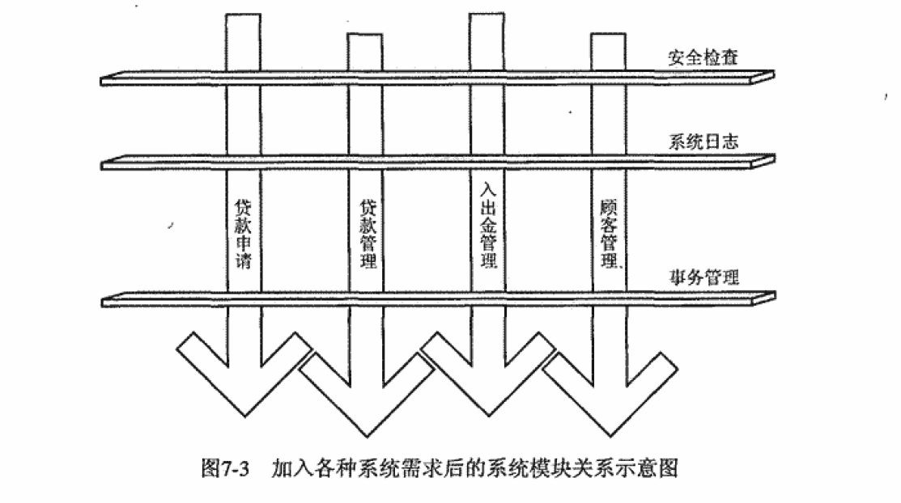

# Spring框架概述？

Spring倡导基于POJO（Plain Old Java Object，简单Java对象）的轻量级开发理念，Spring为构建应用的POJO提供各种服务，进而创造了一套适宜用POJO进行轻量级开发的环境。

Spring提供多个相互独立又相互依赖的模块，这些模块组成Spring的核心骨架。



- 整个Spring框架构建在Core核心模块上，它是整个框架的基础。在该模块中，Spring为我们提供了一个IOC容器（IOC Container）实现，用于帮助我们以依赖注入的方式管理对象之间的依赖关系。除此之外，Core核心模块还包括框架内部使用的各种工具类。
- 然后是AOP模块，该模块提供一个轻便但功能强大的AOP框架，让我们以AOP的形式增强POJO的能力，补充OOP的功能。Spring AOP模块采用Proxy模式构建，与IOC容器相结合。
- Spring框架在Core核心模块和AOP模块的基础上，提供了完备的数据访问和事务管理的抽象与集成服务。
  - 在数据访问支持方面，Spring对JDBC API的最佳实践进行了封装与抽象，从而简化使用。除此之外，Spring还为业界流行ORM产品提供了形式统一的集成支持。
  - Spring框架的事务管理抽象层是Spring AOP的最佳实践，它直接构建在Spring AOP的基础之上，为我们提供了编程式事务管理和声明式事务管理的支持。
- Spring框架提供了一套自己的Web MVC框架，采用了职责分明的角色划分。
- 为了简化各种Java EE服务的使用，Spring框架为我们提供了针对这些Java EE服务的集成服务。

# Core

## IOC的基本概念？

IOC的全程为Inversion of Control，中文翻译为“控制反转”。在Sring中，它有一个别名叫做依赖注入（Dependency Injection）。IOC的理念可以说是“让别人为你服务！”具体说来，就是把被注入对象和被依赖对象都交给IOC容器管理，而它们之间的依赖关系也由容器管理。

依赖注入的方式有两种：

- 构造方法注入：就是被注入对象可以通过在其构造方法中声明依赖对象的参数列表，让IOC容器知道它需要哪些依赖对象。
- setter方法注入：当前对象为其依赖对象所对应的属性添加setter方法，就可以通过setter方法将相应的依赖对象设置到注入对象中。

两种方式比较：

- 构造方法注入：
  - 优点：强制要求提供所有必需的依赖，使得类的实例总是处于有效状态。便于实现类的无状态化，有利于线程安全。
  - 缺点：如果有多个依赖，构造器的参数列表会很长，影响代码的可读性。
- setter方法注入：
  - 提供了更大的灵活性，可以在对象创建后随时修改依赖关系，适用于可选依赖或配置更改。
  - 对象可能在构造后处于不完全初始化的状态，直到所有的Setter方法都被调用。增加了管理对象生命周期的复杂度，可能引发未完全初始化就使用对象的问题。

概况的说起来，IOC是一种可以帮助我们解耦各业务对象间依赖关系的对象绑定方式。因为注入被依赖对象，实际上是注入那个对象实现的接口，这里采用多态的特性，可以在被注入对象中依赖不同的对象，只要它实现的对应的接口。

## IOC Service Provider？

IOC Service Provider是一个抽象概念，表示任何将IoC场景中的业务对象绑定到一起的实现方式。

IOC Service Provider的职责为：

- 业务对象的构建管理。IOC Service Provider将不管是被注入对象还是被依赖对象都构建出来。
- 业务对象间的依赖绑定。IOC Service Provider通过结合之前构建和管理的所有业务对象，以及各个业务对象间可以识别的依赖关系，将这些对象所依赖的对象注入绑定，从而保证每个业务对象在使用的时候，处于就绪状态。

IOC容器管理依赖关系的方式：

1. 配置文件：通过XML配置文件来定义Bean以及它们之间的依赖关系。
2. 注解（Annotations）：使用注解来标记类、构造方法、字段或方法，以及声明依赖关系。
3. Java配置类：使用Java类来配置Bean和依赖关系。

## IOC容器之BeanFactory和ApplicationConetext对比？

IOC容器与IOC Service Provider是一种包含关系，前者在后者的基础上还提供对象生命周期管理、AOP支持等功能。

Spring提供两种容器类型：BeanFactory和ApplicationContext

- BeanFactory：基础IoC容器类型，默认采用懒加载机制（lazy-load），只要当受管对象被使用的时候，才会对其进行初始化以及依赖注入操作。所以容器的启动速度较快，所需的资源有限。
- ApplicationContext：ApplicationContext在BeanFactory的基础上建构，额外提供了事件发布、国际化信息支持等。ApplicationContext管理的对象，在容器启动的时候，默认全部初始化和依赖绑定。所以容器启动速度相对慢，系统资源消耗更多。

BeanFactory，顾名思义是生成JavaBean对象的工厂，提供获取Bean对象的方法接口。使用了BeanFactory，就要使用IoC模式进行系统业务对象的开发，即业务对象不关系自己所依赖的业务对象是怎么引入进来的，有BeanFactory来管理这一切。

## 对象注册和依赖绑定方式？

关于Bean的注册和依赖绑定，主要通过以下几种方式进行：

1. **XML配置方式**

   **注册Bean：**

   在Spring的XML配置文件中，每个`<bean>`标签就定义了一个Bean的实例。

   ```xml
   <beans xmlns="http://www.springframework.org/schema/beans"
          xmlns:xsi="http://www.w3.org/2001/XMLSchema-instance"
          xsi:schemaLocation="http://www.springframework.org/schema/beans
              http://www.springframework.org/schema/beans/spring-beans.xsd">
   
       <bean id="myBean" class="com.example.MyClass"/>
   </beans>
   ```

   这里，`id`属性用于给Bean命名，`class`属性指定了Bean的实现类。

   **依赖绑定：**

   通过`property`标签指定Bean之间的依赖关系。

   ```xml
   <bean id="service" class="com.example.Service"/>
   <bean id="client" class="com.example.Client">
       <property name="service" ref="service"/>
   </bean>
   ```

   这表示`Client`类中有一个名为`service`的属性或setter方法，它将被注入一个`Service`类型的实例。

2. **注解方式**

   随着Spring的发展，注解成为更受欢迎的配置方式，简化了配置并减少了XML的使用。

   **注册Bean：**

   使用`@Component`、`@Service`、`@Repository`、`@Controller`等注解可以直接标记在类上，声明这些类作为Spring管理的Bean。同时，需要在配置类或XML中启用组件扫描（`@ComponentScan`或`<context:component-scan>`）。

   **依赖绑定：**

   - `@Autowired`注解可以自动为Bean的字段或方法注入所需的依赖。Spring会根据类型进行匹配。
   - `@Qualifier`注解与`@Autowired`一起使用时，可以在多个相同类型的Bean中指定具体要注入哪一个。
   - `@Resource`注解（来自JDK）也可以用来注入依赖，它既可以根据名称也可以根据类型注入。

   ```java
   @Service
   public class MyService {}
   
   @Controller
   public class MyController {
       @Autowired
       private MyService myService; // 自动注入MyService实例
   }
   ```

3. **Java配置方式**

   从Spring 3.0开始，引入了基于Java的配置方式，通过编写Java类来替代XML配置。

   **注册Bean：**

   使用`@Configuration`标记配置类，`@Bean`方法来定义Bean实例。

   ```java
   @Configuration
   public class AppConfig {
       @Bean
       public MyBean myBean() {
           return new MyBean();
       }
   }
   ```

   **依赖绑定：**

   直接在`@Bean`方法中调用其他`@Bean`方法来实现依赖注入。

   ```java
   @Configuration
   public class AppConfig {
       @Bean
       public Service service() {
           return new Service();
       }
   
       @Bean
       public Client client() {
           Client client = new Client();
           client.setService(service()); // 依赖注入
           return client;
       }
   }
   ```

## Bean管理的核心机制？

BeanFactory只是一个接口，DefaultListableBeanFactory是比较通用的BeanFactory实现类。DefaultListableBeanFactory除了间接地实现了BeanFactory接口，还实现了BeanDifinitionRegistry接口，该接口才是在BeanFactory实现中担任Bean注册管理的角色。基本上，BeanFactory接口只定义如何访问容器内管理的Bean的方法，各个BeanFactory的具体实现类负责具体的Bean的注册以及管理工作。BeanDefinitionRegistry接口定义抽象了Bean的注册逻辑。通常情况下，具体的BeanFactory实现类会实现这个接口来管理Bean的注册。



每一个受管的对象，在容器中都会有一个BeanDefinition的实例（instance）与之相对应，该BeanDefinition的实例负责保存对象的所有必要信息，包括其对应的对象的class类型、是否是抽象类、构造方法参数以及其他属性等。当客户端向BeanFactory请求相应对象的时候，BeanFactory会通过这些信息为客户端返回一个完备可用的对象实例。RootBeanDefinition和ChildBean-Definition是BeanDefinition的两个主要实现类。

不管是各种注册与配置方式，由BeanDefinitionReader的相应实现类负责将相应的配置文件内容读取并映射到BeanDefinition，然后将映射后的BeanDefinition注册到一个BeanDefinitionRegistry，之后，BeanDefinitionRegistry即完成Bean的注册和加载。当然，大部分工作，包括解析文件格式、装配BeanDefinition之类的工作，都是由BeanDefinitionReader的相应实现类来做的，BeanDefinitionRegistry只不过负责保管而已。

以下是核心要点的概括：

1. **BeanFactory接口**：这是Spring IoC容器的基础接口，定义了如何访问和管理容器中Bean的方法，但不涉及Bean的注册和配置细节。具体实现（如`DefaultListableBeanFactory`）负责实现这些方法并管理Bean的生命周期。
2. **DefaultListableBeanFactory**：它是`BeanFactory`的一个全面实现，不仅实现了Bean的获取、实例化、依赖注入等功能，还实现了`BeanDefinitionRegistry`接口，这意味着它具备了Bean定义的注册能力，是管理Bean定义和实例的关键组件。
3. **BeanDefinitionRegistry接口**：此接口专门负责Bean定义的注册逻辑，是Bean注册的核心抽象。任何实现了这个接口的类都能够注册和管理Bean定义（`BeanDefinition`）。`DefaultListableBeanFactory`通过实现这个接口，承担起了Bean定义的注册任务。
4. **BeanDefinition**：代表了容器中每个受管对象的元数据信息，包括类名、作用域、构造参数、属性值等。每个Bean在容器中都有对应的`BeanDefinition`实例，它是创建Bean实例的蓝图。
5. **BeanDefinitionReader**及其实现类：负责解析配置信息（无论是XML、注解还是Java配置），并将这些信息转换为`BeanDefinition`。这个过程涵盖了文件格式解析、依赖关系解析、装配Bean定义等步骤。
6. **Bean的注册和加载流程**：配置信息通过`BeanDefinitionReader`读取后，转换生成的`BeanDefinition`会被注册到`BeanDefinitionRegistry`（如`DefaultListableBeanFactory`），完成Bean的注册。之后，当应用需要某个Bean时，`BeanFactory`依据注册的`BeanDefinition`实例化并管理Bean的生命周期，提供给应用程序使用。

综上所述，这段话概述了Spring如何通过分层的设计（BeanFactory接口、BeanDefinition、BeanDefinitionRegistry接口以及BeanDefinitionReader）来实现Bean的定义注册、解析、实例化及管理，展示了Spring框架高度灵活和可扩展的IoC容器机制。

## 容器实现原理？

### 容器启动阶段

1. **资源定位与载入**
   - **资源定位**：Spring容器首先需要找到定义Bean的配置资源，这些资源可以是XML文件、注解配置的类、Java配置类等。通过`ResourceLoader`接口和其实现类（如`ClassPathResource`, `FileSystemResource`等），Spring能够从不同的位置加载资源文件。
   - **载入配置**：使用`BeanDefinitionReader`（如`XmlBeanDefinitionReader`、`AnnotationConfigBeanDefinitionReader`）来读取资源中的配置信息。这些Reader会解析配置，创建对应的`BeanDefinition`对象。
2. **注册Bean定义**
   - 解析得到的`BeanDefinition`被注册到`BeanDefinitionRegistry`中。`DefaultListableBeanFactory`就是一个实现了`BeanDefinitionRegistry`的类，它维护了一个Bean定义的注册表，用于存储所有Bean的定义信息。
3. **BeanDefinition解析与处理**
   - **解析**：根据配置的不同，解析器会处理XML标签、注解或Java配置类中的@Bean方法，将配置信息转化为`BeanDefinition`对象。
   - **后处理器**：`BeanDefinitionRegistryPostProcessor`和`BeanFactoryPostProcessor`允许对Bean定义进行进一步的修改或处理。例如，`PropertySourcesPlaceholderConfigurer`处理占位符，`CustomAutowireConfigurer`自定义自动装配规则等。
4. **依赖解析与排序**
   - Spring会分析Bean之间的依赖关系，并对Bean进行排序，确保依赖的Bean先于依赖它的Bean实例化。

### Bean实例化阶段

1. **Bean实例化**
   - 对于每个Bean，Spring容器根据其`BeanDefinition`确定实例化策略。这可能涉及简单实例化（使用默认构造函数）、工厂方法、或者使用工厂Bean来创建实例。
2. **依赖注入**
   - 实例化后，Spring根据`BeanDefinition`中的依赖信息，通过反射为Bean设置属性（依赖注入）。这包括构造器注入、setter注入等。
3. **初始化前处理**
   - 如果Bean定义中指定了初始化方法（通过@PostConstruct注解或<bean init-method="">），则在依赖注入完成后，但在Bean正式投入使用之前调用这些方法。
4. **Aware 接口回调**
   - 如果Bean实现了Spring提供的Aware接口（如BeanNameAware, ApplicationContextAware等），Spring会在适当的时候回调这些接口的方法，让Bean能感知到自己的名字、所在容器等信息。
5. **AOP代理**
   - 如果配置了AOP切面，Spring可能会为目标Bean创建代理对象，以便在调用Bean方法前后执行切面逻辑。
6. **初始化后处理**
   - `InitializingBean`接口的`afterPropertiesSet()`方法或自定义初始化方法（通过`@PostConstruct`或`<bean init-method="">`指定）在此阶段执行，完成Bean的最终准备。
7. **Bean就绪**
   - 经过上述步骤，Bean完全初始化并准备好使用。通过ApplicationContext或BeanFactory的getBean()方法即可获取到这些实例。

整个过程中，Spring容器通过高度可配置和可扩展的机制，支持复杂的依赖管理和生命周期管理，保证了应用的灵活性和可维护性。

## ApplicationContext的特性？

1. **便捷的资源访问：**`ApplicationContext`提供了访问外部资源（如文件系统、类路径资源）的便捷方法，比如通过`Resource`接口和其实现类来加载配置文件或模板文件。
2. **国际化信息支持：**它支持消息资源的国际化，即能够根据用户的区域设置来加载不同语言的错误信息和提示信息。
3. **事件驱动模型：**`ApplicationContext`引入了事件监听机制，允许Bean注册为监听器来监听特定的上下文事件，增强了应用的响应能力和模块间的解耦。
4. **提前初始化Bean：**与`BeanFactory`在首次请求Bean时才实例化不同，`ApplicationContext`在启动时就会预先实例化所有的非懒加载单例Bean。

## 统一资源加载策略？

在Spring框架中，`Resource`和`ResourceLoader`是实现统一资源加载策略的两个核心组件，它们的设计旨在提供一种灵活且一致的方式来访问不同来源的资源，如文件系统、类路径、HTTP URL等。

### Resource

`Resource`接口是Spring框架提供的一个核心接口，它代表了对底层资源的抽象，如文件、类路径资源、URL资源等。这个接口的设计目的是为了提供一种统一的方式来访问和操作各种类型的资源，而不需要关心资源的具体来源或实现细节。主要方法包括：

- `exists()`: 判断资源是否存在。
- `isReadable()`: 判断资源是否可读。
- `getInputStream()`: 获取资源的输入流，用于读取资源内容。
- `getURI()`, `getURL()`, `getFile()`: 分别获取资源的URI、URL或File表示形式（如果适用）。
- 其他一些方法用于获取资源的描述信息，如名称、路径等。

常见的`Resource`实现包括：

- `ClassPathResource`: 访问类路径上的资源。
- `FileSystemResource`: 访问文件系统的资源。
- `UrlResource`: 访问URL指定的资源。
- `ServletContextResource`: 访问Web应用上下文中的资源。

### ResourceLoader

`ResourceLoader`接口定义了加载资源的策略，它提供了一个统一的方法来获取`Resource`对象，使得应用程序可以以一种统一的方式处理资源，而不需要直接与各种`Resource`实现交互。其核心方法是：

- `getResource(String location)`: 根据给定的位置字符串加载资源。位置字符串可以是绝对路径、相对路径或协议特定的路径（如"classpath:"、"file:"、"http:"）。

Spring的`ApplicationContext`接口扩展了`ResourceLoader`，意味着所有的Spring应用上下文都可以用来加载资源，无需直接创建`ResourceLoader`的实例。此外，Spring的`DefaultResourceLoader`是一个基础的实现类，它提供了基本的资源加载逻辑，并且可以被其他更具体的资源加载器类扩展。

**统一资源加载的意义**

这一策略的重要意义在于它提供了一种统一的、与具体实现无关的方式来访问资源，极大地提升了代码的可移植性和可维护性。开发者无需关注资源的物理位置或访问方式，只需要使用`Resource`接口进行操作，Spring框架会根据资源的位置自动选择合适的`Resource`实现进行加载，这样就实现了资源加载的解耦和抽象化。

## 事件驱动机制？

Spring框架中的`ApplicationContext`采用了事件驱动模型，这是一种设计模式，允许**对象之间通过发送事件和监听事件来进行耦合的通信**。这一模型在Spring中主要用于应用程序上下文的初始化、刷新、关闭等生命周期管理和组件间的解耦通信。以下是其核心组成部分和使用场景：

**核心组件**

1. **ApplicationEvent（应用事件）**：所有事件的基类，继承自Java的`java.util.EventObject`。自定义事件应继承此类。
2. **ApplicationListener（应用监听器）**：任何想要监听特定类型事件的类都需要实现此接口，并提供一个`onApplicationEvent`方法来处理接收到的事件。
3. **ApplicationEventPublisher（应用事件发布者）**：这是`ApplicationContext`接口的一部分，允许向容器内的所有注册监听器广播事件。任何Spring管理的bean都可以注入此接口来发布事件。
4. **ApplicationEventMulticaster（应用事件多播器）**：负责查找并调用所有注册了对应事件类型的监听器。它是`ApplicationEventPublisher`背后的实际执行者，但通常开发者不需要直接与其交互。

**示例**

- 定义事件：

  ```java
  public class CustomEvent extends ApplicationEvent{
      public CustomEvent(Object source, String message) {
          super(source);
          this.message = message;
      }
      private String message;
  }
  ```

- 定义监听器：

  ```java
  @Component
  public class CustomEventListener implements ApplicationListener<CustomEvent> {
  	@Override
      public void onApplicationEvent(CustomEvent event) {
          System.out.println("Received custom event - " + event.getMessage());
      }
  }
  ```

- 发布事件：

  ```java
  @Autowired
  private ApplicationEventPublisher publisher;
  
  public void someMethod() {
      publisher.publishEvent(new CustomEvent(this, "Hello World!"));
  }
  ```

  通过上述机制，Spring应用可以在不同组件间实现灵活且解耦的通信，增强系统的可扩展性和可维护性。

# AOP

## AOP的缘起？

软件开发的目的，是为了解决各种需求，包括业务需求和系统需求。使用面向对象方法，可以很好的对业务需求进行抽象和封装，并使之模块化。可是像安全检查和日志记录等系统需求，可能很多业务对象都会涉及，如果系统很庞大，那么要维护的系统需求代码量将是巨大的。于是AOP作为OOP开发模式的一种补充就应运而生了。



AOP全程Aspect-Oriented Programming，中文译为面向切面编程。在一个软件系统当中，安全检查、日志记录、事务管理等系统需求像一把刀横切在各个业务功能模块之上，换成AOP的语言说，这些系统需求是系统中的横切关注点（cross-cutting concern）。AOP引入Aspect的概念，用以模块化的形式对系统中的横切关注点进行封装。Aspect之对于AOP，就相当于Class之对于OOP。我们说AOP是OOP方法的补足，当把以Class形式模块化的业务需求和以Aspect形式模块化的系统需求拼装到一起时，整个系统就算完成了。

## AOP实现机制？

1. **JDK动态代理**

   **实现机制：**

   - 基于Java的反射机制和`java.lang.reflect.Proxy`类。
   - 要求目标对象必须实现至少一个接口。代理对象是在运行时根据接口生成的一个实现所有这些接口的新类的实例。
   - 动态生成的类继承了`Proxy`类，并实现了目标接口。
   - 开发者需要提供一个实现了`InvocationHandler`接口的类，该接口的`invoke()`方法会在代理对象调用任何方法时被调用，允许在调用前后添加额外的处理逻辑。

   **执行过程：**

   1. 定义接口与实现类

      首先，需要定义一个或多个接口来声明目标方法。然后，创建一个实现了这些接口的具体类，这个类就是我们要代理的目标类。

   2. 实现InvocationHandler接口

      接下来，需要创建一个实现了`java.lang.reflect.InvocationHandler`接口的类。这个类是代理逻辑的核心，它包含了一个`invoke()`方法，所有对代理对象的调用都会被转发到这里。在`invoke()`方法中，你可以添加增强逻辑，比如日志记录、权限检查、事务管理等，然后再调用目标方法的原始实现。

   3. 生成代理类

      使用`java.lang.reflect.Proxy`类的静态方法`newProxyInstance()`来创建代理对象。这个方法需要三个参数：

      - **ClassLoader**: 用于加载代理类的类加载器，通常使用目标类的类加载器。
      - **interfaces**: 代理类需要实现的接口数组，这里的接口就是目标类实现的那些接口。
      - **h**: 实现了`InvocationHandler`接口的对象，它包含了代理逻辑。

      此方法会根据提供的信息动态地在运行时生成一个新的代理类，这个类继承了`Proxy`类，并实现了指定的接口。

   4. 通过代理对象调用方法

      通过代理对象调用目标方法时，实际上会调用到`InvocationHandler`的`invoke()`方法。在这个方法里，你可以先执行一些预处理逻辑，然后调用目标方法的原始实现（通过`Method.invoke()`），最后再执行一些后处理逻辑。

   具体流程描述：

   1. **调用初始化**：用户代码调用`Proxy.newProxyInstance()`方法时，Java运行时环境检查指定的接口和类加载器，并根据这些信息动态地创建一个继承自`Proxy`类的子类（这个子类也是目标接口的实现类）。
   2. **代理类构造**：生成的代理类包含对`InvocationHandler`的引用，代理类的方法调用最终都会委派给这个`InvocationHandler`的实例。
   3. **方法调用转发**：当通过代理对象调用任何一个接口方法时，这个调用会被转发给`InvocationHandler`的`invoke()`方法。在`invoke()`方法中，你可以访问到被调用的方法信息（如方法名、参数等），并决定如何处理这个调用，包括是否调用目标方法以及调用前后的附加操作。
   4. **执行结果**：`invoke()`方法处理完所有逻辑后，会返回方法的执行结果，这个结果会作为代理方法的返回值。

   **代码示例：**

   ```java
   import java.lang.reflect.InvocationHandler;
   import java.lang.reflect.Proxy;
   import java.lang.reflect.Method;
   
   /**
    * 下面是一个简单的JDK动态代理的代码示例。在这个例子中，我们有一个接口Subject，以及其实现类RealSubject。
    * 我们将创建一个动态代理类来代理RealSubject，并在调用其方法时添加额外的日志记录功能。
    */
   
   // 接口Subject
   interface Subject{
       void doSomething();
       void anotherAction();
   }
   
   // 实现类RealSubject
   class RealSubject implements Subject {
       @Override
       public void doSomething() {
           System.out.println("RealSubject: doSomething");
       }
   
       @Override
       public void anotherAction() {
           System.out.println("RealSubject: anotherAction");
       }
   }
   
   class DynamicProxyHandler implements InvocationHandler {
       private Object target;
   
       public DynamicProxyHandler(Object target) {
           this.target = target;
       }
   
       @Override
       public Object invoke(Object proxy, Method method, Object[] args) throws Throwable {
           System.out.println("Before method: " + method.getName());
           Object result = method.invoke(target, args);
           System.out.println("After method: " + method.getName());
           return result;
       }
   }
   
   public class Main {
       public static void main(String[] args) {
           // 创建真实主题对象
           RealSubject realSubject = new RealSubject();
   
           // 创建动态代理对象
           Subject proxyObject = (Subject) Proxy.newProxyInstance(
                   RealSubject.class.getClassLoader(),
                   RealSubject.class.getInterfaces(),
                   new DynamicProxyHandler(realSubject)
           );
   
           // 调用代理对象的方法
           proxyObject.doSomething();
           proxyObject.anotherAction();
       }
   }
   ```

   执行结果：

   ```
   Before method: doSomething
   RealSubject: doSomething
   After method: doSomething
   Before method: anotherAction
   RealSubject: anotherAction
   After method: anotherAction
   ```

2. **CGLIB代理**

   **实现机制：**

   - 使用第三方库CGLIB（Code Generation Library），通过ASM字节码操作框架，可以在运行时动态生成目标类的子类。
   - 不要求目标对象实现接口，可以直接对任何类生成代理对象。
   - 代理类是通过继承目标类并在其方法中插入拦截逻辑来实现的。
   - 开发者通常通过`MethodInterceptor`接口来定义拦截逻辑，该接口的`intercept()`方法类似于JDK动态代理中的`invoke()`方法。

   **执行过程：**

   1. 引入依赖

      使用CGLIB动态代理之前，需要引入CGLIB库到项目中。

   2. 创建目标类

      CGLIB可以代理没有实现接口的类。因此，你可以直接创建一个具体类（无需实现任何接口），这个类包含了你想要增强的方法。

   3. 定义MethodInterceptor（拦截器）

      CGLIB动态代理的核心是`MethodInterceptor`接口，你需要创建一个实现该接口的类。这个类中有一个`intercept()`方法，类似于JDK动态代理中的`InvocationHandler.invoke()`，在此方法中你可以添加代理逻辑，如日志记录、权限校验等。

   4. 通过Enhancer创建代理对象

      - **创建Enhancer对象**：`Enhancer`是CGLIB中的核心类，用于创建动态代理类。首先，通过`Enhancer.create()`方法创建一个`Enhancer`实例。
      - **设置父类**：使用`setSuperclass(Class<T> superclass)`方法指定要代理的目标类作为父类。
      - **设置回调**：使用`setCallback(MethodInterceptor interceptor)`方法或`setCallbacks(MethodInterceptor[] interceptors)`方法指定拦截器。拦截器负责实现增强逻辑。
      - **创建代理类**：调用`create()`方法，CGLIB会根据指定的父类和回调接口生成一个子类实例，这个实例就是代理对象。

   5. 通过代理对象调用方法

      当通过代理对象调用方法时，CGLIB会在运行时将调用转发给由`MethodInterceptor`定义的`intercept()`方法。在这个方法内部，你可以获取到被调用的方法信息，执行前置处理，调用原方法（通过`MethodProxy.invoke()`），最后执行后置处理，并返回方法的结果。

   **具体流程描述：**

   1. **初始化Enhancer**：创建`Enhancer`实例，指定要创建的动态代理类的父类。
   2. **配置拦截器**：设置`MethodInterceptor`，定义如何处理目标方法的调用。
   3. **生成代理类**：调用`Enhancer.create()`生成代理对象。CGLIB通过字节码技术在内存中动态生成目标类的子类，并在子类中织入拦截逻辑。
   4. **方法调用拦截**：当通过代理对象调用目标方法时，实际执行的是`MethodInterceptor.intercept()`方法。在这个方法中，你可以执行自定义的拦截逻辑，决定是否调用原方法，以及如何处理调用前后的工作。
   5. **执行结果返回**：拦截器处理完成后，返回调用方法的结果。

   **代码示例：**

   ```java
   import org.springframework.cglib.proxy.Enhancer;
   import org.springframework.cglib.proxy.MethodInterceptor;
   import org.springframework.cglib.proxy.MethodProxy;
   
   import java.lang.reflect.Method;
   
   class Person {
       public void sayHello(String name) {
           System.out.println("Hello, " + name);
       }
   }
   
   class LoggingInterceptor implements MethodInterceptor {
       @Override
       public Object intercept(Object obj, Method method, Object[] args, MethodProxy proxy) throws Throwable {
           // 在调用方法前打印日志
           System.out.println("Before method: " + method.getName());
   
           // 调用原方法
           Object result = proxy.invokeSuper(obj, args);
   
           // 在调用方法后打印日志
           System.out.println("After method: " + method.getName());
   
           return result;
       }
   }
   
   public class Main {
       public static void main(String[] args) {
           // 创建Enhancer对象
           Enhancer enhancer = new Enhancer();
   
           // 设置目标类
           enhancer.setSuperclass(Person.class);
   
           // 设置拦截器
           enhancer.setCallback(new LoggingInterceptor());
   
           // 创建代理对象
           Person personProxy = (Person) enhancer.create();
   
           // 通过代理对象调用方法
           personProxy.sayHello("Alice");
       }
   }
   
   ```

## AOP有哪些概念？

**JointPoint**

连接点，代表了切面代码能够被织入到现有应用程序代码中的地点，AOP框架可以在这些点拦截并应用切面中定义的额外行为，而无需修改应用程序的原始源代码。

分类：

1. 方法执行：这是最常见的连接点类型，包括类中的方法调用。Spring AOP主要关注这类连接点，允许在方法调用前后、环绕方法调用或者在方法抛出异常时插入切面逻辑。
2. 异常处理：当程序中抛出或捕获异常时，也可以视为一种连接点。切面可以利用此连接点来统一处理异常，比如记录日志或执行补偿操作。
3. 构造函数调用：虽然不普遍，但在某些AOP框架中，构造函数的调用也可能被视为连接点，允许在对象创建时应用切面逻辑。
4. 字段访问：某些AOP框架，如AspectJ，允许在访问或修改字段值时定义连接点，从而实现对字段级操作的横切关注点插入。
5. 定时事件：虽然不直接属于传统意义上的方法执行，但在某些上下文中，定时触发的事件或任务也可以视为连接点，尤其是当AOP框架支持对这类事件的拦截和增强时。

**Pointcut**

切点用于定义一组连接点的集合，这些连接点是切面所关注的，即切面将在这些位置插入特定的横切关注点逻辑（即通知）。简单来说，切点就是用来匹配和筛选出感兴趣的连接点的一个表达式或者规则。

**Advice**

通知是指在切点匹配到的连接点处执行的代码片段，用于实现横切关注点的功能。通知定义了在特定的程序执行点应该执行什么样的操作。常见的通知类型：

1. 前置通知（Before Advice）：

   在目标方法被执行之前执行的通知。它不能阻止目标方法的执行，主要用于进行预处理操作，比如验证权限、记录日志等。

2. 后置通知（After Advice）：

   在目标方法正常执行完毕之后执行的通知，无论目标方法是否成功完成（即有没有抛出异常），都会执行。常用于资源清理、关闭文件等操作。

3. 返回后通知（After Returning Advice）：

   只有当目标方法成功执行完毕并且没有抛出任何异常时才会执行的通知。适用于在方法返回结果后需要进一步处理的场景，如记录操作结果。

4. 异常后通知（After Throwing Advice）：

   当目标方法执行过程中抛出异常时执行的通知。可以用来记录异常信息、执行异常处理逻辑等。

5. 环绕通知（Around Advice）：

   最为灵活的一种通知类型，它包裹了目标方法的执行。环绕通知可以在目标方法调用之前和之后自定义执行代码，并且可以选择是否调用目标方法（通过ProceedingJoinPoint的proceed()方法），甚至改变方法的调用结果或异常行为。这使得环绕通知可以完全控制目标方法的执行流程。

**Aspect**

切面封装了横切关注点的实现，这些关注点通常会跨越系统的多个模块。切面将关注点从业务逻辑中分离出来，使系统更加模块化，便于维护和扩展。

## Spring AOP？

Spring AOP（Aspect-Oriented Programming in Spring框架）是Spring框架提供的面向切面编程实现，它允许开发者将横切关注点（如日志记录、事务管理、安全性等）从业务逻辑中分离出来，通过声明式的配置或注解方式，实现这些关注点的集中管理和代码复用。Spring AOP基于代理模式实现，主要支持两种代理方式：JDK动态代理和CGLIB代理。

**核心概念**

1. **切面（Aspect）**：封装了横切关注点的实现，包括切点（Pointcut）和通知（Advice）。
2. **切点（Pointcut）**：定义了切面应该在哪些连接点（Joinpoint）上执行。Spring AOP使用强大的切点表达式语言来精确匹配连接点。
3. **通知（Advice）**：切面在特定连接点执行的实际操作，有五种类型：前置通知（Before）、后置通知（After）、返回后通知（After Returning）、异常后通知（After Throwing）和环绕通知（Around）。
4. **连接点（Joinpoint）**：程序执行过程中的一个点，如方法调用，是切面可以插入的地方。Spring AOP只支持方法执行的连接点。
5. **代理（Proxy）**：Spring AOP通过创建目标对象的代理来实现切面逻辑的织入。对于实现了接口的类，Spring默认使用JDK动态代理；对于没有实现接口的类，则使用CGLIB代理。

**实现方式**

- **基于XML的配置**：通过在Spring配置文件中定义aop命名空间下的元素来配置切面、切点和通知。
- **基于注解的配置**：使用`@Aspect`、`@Before`、`@After`、`@AfterReturning`、`@AfterThrowing`、`@Around`等注解来直接在Java类中定义切面和通知逻辑。

**特性与限制**

- **运行时织入**：Spring AOP是在运行时通过代理实现切面逻辑的织入，这意味着不需要特殊的编译步骤。
- **编织范围**：由于Spring AOP基于代理，因此它只能拦截通过Spring管理的bean的公共方法调用。它不支持对构造函数调用、静态方法、私有方法或final方法的拦截。
- **性能考虑**：虽然动态代理会带来一定的性能开销，但对于大多数应用来说，这种开销是可以接受的，特别是在考虑到AOP带来的设计优势时。

**应用场景**

- **日志记录**：在方法调用前后自动记录日志信息。
- **事务管理**：自动管理数据库操作的事务边界。
- **安全性**：实施权限验证和授权逻辑。
- **性能监控**：收集方法执行时间等性能指标。
- **缓存**：自动缓存方法的结果以提高性能。

**代码示例**

```java
import org.aspectj.lang.annotation.Aspect;
import org.aspectj.lang.annotation.Before;
import org.springframework.stereotype.Component;

@Aspect
@Component
public class LoggingAspect {

    @Before("execution(* com.example.myapp.service.*.*(..))")
    public void logBeforeServiceMethods(JoinPoint joinPoint) {
        String methodName = joinPoint.getSignature().getName();
        System.out.println("Executing: " + methodName);
    }
}
```

- `@Aspect`注解标记这是一个切面类。
- `@Component`注解让Spring容器识别并管理这个切面。
- `@Before`注解定义了一个前置通知，将在匹配的方法执行前执行。
- `execution(* com.example.myapp.service.*.*(..))`是切点表达式，它匹配`com.example.myapp.service`包下所有类的所有方法。
  - `*` 表示任意返回类型。
  - `com.example.myapp.service.*` 匹配`com.example.myapp.service`包及其子包下的所有类。
  - `*.*` 匹配所有方法。
  - `(..)` 表示可以接受任意数量和类型的参数。

# Data Access/Integration

# Web


## Spring MVC的核心组件有哪些？

1. DispatchServlet：它是前端控制器，负责接收客户端请求并将请求分发给合适的处理程序（Controller）进行处理。
2. HandlerMapping：用于将请求映射到处理程序（Controller）的组件。它确定哪个 Controller 将处理特定的请求。
3. Controller：处理请求并生成响应的组件。在 Spring MVC 中，Controller 是一个 POJO（Plain Old Java Object）类，通常用注解标记。
4. Model：用于在处理程序（Controller）和视图之间传递数据的对象。处理程序可以将数据添加到 Model 中，然后视图可以使用这些数据来渲染页面。
6. ViewResolver：用于解析视图逻辑名称并查找实际视图对象的组件。它将逻辑视图名称解析为实际的视图对象，以便呈现给用户。
6. View：负责将模型数据渲染为最终的输出（通常是 HTML 页面）。
6. HandlerInterceptor：拦截器，用于在请求处理程序执行前后进行预处理和后处理操作。可以用于实现日志记录、权限检查等功能。
6. ModelAndView：一个包含模型数据和视图名称的对象，用于同时包含数据和视图信息。

## 解释一下Spring MVC的请求处理流程？

请求首先到达DispatcherServlet，DispatcherServlet通过HandlerMapping找到相应的处理器（Controller），处理器处理请求并返回ModelAndView，DispatcherServlet再通过ViewResolver找到相应的视图并渲染输出。

## 如何在Spring MVC中处理表单数据提交？

可以使用`@ModelAttribute`注解将表单数据绑定到Java对象，并在控制器方法中接收该对象进行处理。

## 如何在Spring MVC中进行文件上传？

可以使用`MultipartFile`类，并在控制器方法中接收`MultipartFile`对象，处理文件上传逻辑。

## 如何在Spring MVC中进行数据验证？

可以使用`@Valid`注解结合JSR-303/JSR-380（Bean Validation）进行数据验证，并处理BindingResult对象中的验证错误。

## 如何在Spring MVC中处理异常？

可以使用`@ExceptionHandler`注解定义全局或局部异常处理方法，或者使用`@ControllerAdvice`进行全局异常处理。

## 解释一下Spring MVC中的视图解析机制？

视图解析由ViewResolver接口及其实现类完成，根据视图名称解析出具体的视图对象。

## Spring MVC中的拦截器（Interceptor）是什么？如何使用它们？

拦截器用于在请求处理的各个阶段（如处理请求前、处理请求后、视图渲染前）执行额外的逻辑。可以通过实现HandlerInterceptor接口并在配置类中注册拦截器来使用。

## 你在实际项目中遇到过哪些Spring MVC的性能问题？是如何解决的？

## 请描述一下你如何在Spring MVC项目中实现RESTful API

## Spring MVC与Spring Boot结合使用时，有哪些常见的配置和优化技巧？

# Spring框架集成？

## Spring集成MyBatis最佳实践？

在Spring应用中集成MyBatis，可以利用MyBatis强大的SQL映射能力和Spring的依赖注入与事务管理功能，达到简洁且高效的数据访问层。以下是Spring集成MyBatis的一些最佳实践：

1. **配置Mybatis与Spring集成**

   **配置数据源和MyBatis SqlSessionFactory**

   使用Spring配置文件或Java配置类来配置数据源和MyBatis的`SqlSessionFactory`。

   ```java
   @Configuration
   public class MyBatisConfig {
   
       @Bean
       public DataSource dataSource() {
           HikariConfig config = new HikariConfig();
           config.setJdbcUrl("jdbc:mysql://localhost:3306/mydb");
           config.setUsername("user");
           config.setPassword("password");
           return new HikariDataSource(config);
       }
   
       @Bean
       public SqlSessionFactory sqlSessionFactory(DataSource dataSource) throws Exception {
           SqlSessionFactoryBean factoryBean = new SqlSessionFactoryBean();
           factoryBean.setDataSource(dataSource);
           factoryBean.setMapperLocations(new PathMatchingResourcePatternResolver().getResources("classpath:mappers/*.xml"));
           return factoryBean.getObject();
       }
   
       @Bean
       public SqlSessionTemplate sqlSessionTemplate(SqlSessionFactory sqlSessionFactory) {
           return new SqlSessionTemplate(sqlSessionFactory);
       }
   }
   ```

   **配置Mapper扫描**

   使用`@MapperScan`注解扫描Mapper接口所在的包。

   ```java
   @SpringBootApplication
   @MapperScan("com.example.project.mapper")
   public class MyApplication {
       public static void main(String[] args) {
           SpringApplication.run(MyApplication.class, args);
       }
   }
   ```

2. **定义Mapper接口和XML映射文件**

   **定义Mapper接口**

   在Mapper接口中定义SQL操作方法，并使用注解或XML配置进行SQL映射。

   ```java
   public interface UserMapper {
       @Select("SELECT * FROM users WHERE id = #{id}")
       User getUserById(int id);
   
       @Insert("INSERT INTO users(name, email) VALUES(#{name}, #{email})")
       @Options(useGeneratedKeys = true, keyProperty = "id")
       void insertUser(User user);
   }
   ```

   **定义XML映射文件**

   在`resources/mappers`目录下定义XML映射文件。

   ```xml
   <?xml version="1.0" encoding="UTF-8" ?>
   <!DOCTYPE mapper
       PUBLIC "-//mybatis.org//DTD Mapper 3.0//EN"
       "http://mybatis.org/dtd/mybatis-3-mapper.dtd">
   <mapper namespace="com.example.project.mapper.UserMapper">
   
       <select id="getUserById" parameterType="int" resultType="User">
           SELECT * FROM users WHERE id = #{id}
       </select>
   
       <insert id="insertUser" parameterType="User" useGeneratedKeys="true" keyProperty="id">
           INSERT INTO users(name, email) VALUES(#{name}, #{email})
       </insert>
       
   </mapper>
   ```

3. **使用Mapper接口**

   在Service层或其他地方注入Mapper接口，调用其方法进行数据库操作。

   ```java
   @Service
   public class UserService {
   
       @Autowired
       private UserMapper userMapper;
   
       public User getUserById(int id) {
           return userMapper.getUserById(id);
       }
   
       @Transactional
       public void createUser(User user) {
           userMapper.insertUser(user);
       }
   }
   ```

4. **使用事务管理**

   利用Spring的事务管理功能，确保数据库操作的原子性和一致性。可以通过注解或XML配置实现事务管理。

   ```java
   @Service
   public class UserService {
   
       @Autowired
       private UserMapper userMapper;
   
       @Transactional
       public void createUser(User user) {
           userMapper.insertUser(user);
           // 其他数据库操作
       }
   }
   ```

5. **错误处理**

   处理数据库操作中的异常，确保系统的健壮性。

   ```java
   @Service
   public class UserService {
   
       @Autowired
       private UserMapper userMapper;
   
       public User getUserById(int id) {
           try {
               return userMapper.getUserById(id);
           } catch (DataAccessException e) {
               // 处理异常
               System.err.println("Error fetching user: " + e.getMessage());
               throw e;
           }
       }
   }
   ```

6. **优化MyBatis性能**

   利用MyBatis的缓存功能和批量操作，提高性能。

   **配置二级缓存**

   在`mybatis-config.xml`文件中启用二级缓存。

   ```xml
   <configuration>
       <settings>
           <setting name="cacheEnabled" value="true"/>
       </settings>
   </configuration>
   ```

   **使用批量操作**

   在Mapper接口中定义批量插入或更新方法。

   ```java
   public interface UserMapper {
       void insertUsers(List<User> users);
   }
   ```

   在XML映射文件中使用`foreach`标签实现批量操作。

   ```xml
   <insert id="insertUsers">
       INSERT INTO users(name, email) VALUES
       <foreach collection="list" item="user" separator=",">
           (#{user.name}, #{user.email})
       </foreach>
   </insert>
   ```

通过遵循这些最佳实践，可以高效地将MyBatis与Spring集成，提高应用程序的数据访问层的性能和可维护性。